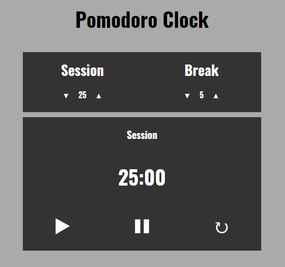

# Pomodoro Clock
A Javascript implementation of a Pomodoro Clock based on the [Pomodoro Technique](https://en.wikipedia.org/wiki/Pomodoro_Technique).

The clock has default values of 25 minutes for a session and 5 minutes for a break. These can be customised to up to 120 minutes for each.

From The Odin Project's [curriculum](https://www.theodinproject.com/lessons/pairing-project).

Creating this project allowed me to practice using many of the Javascript fundamentals as well as DOM manipulation and the use of Event Listeners.